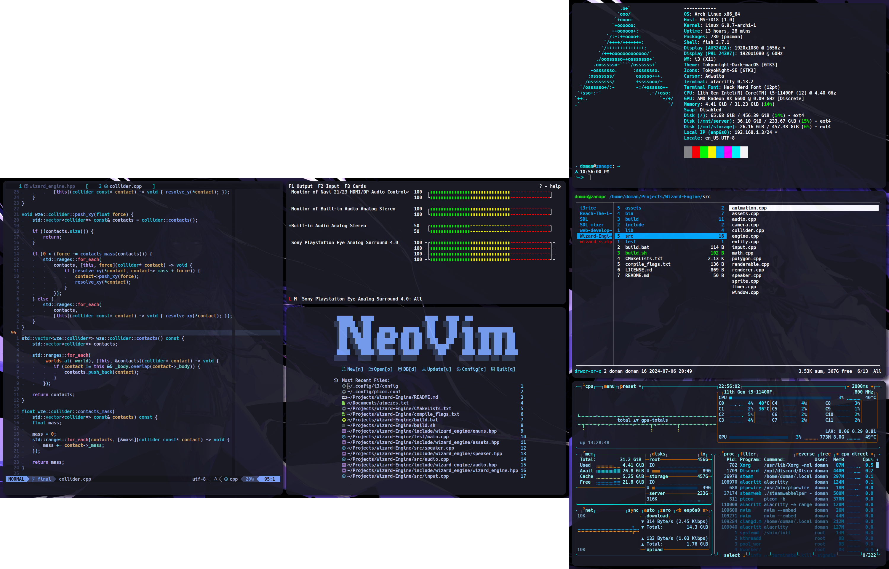

# Preview

# Packages (722)

Dependency: git

## i3wm
Core: i3-wm, i3status\
Server: xorg-server\
Init: xorg-xinit\
Launcher: dmenu\
Layout: i3-layouts (AUR)\
Compositor: picom-ftlabs-git (AUR)\
Wallpaper: feh\
Screenshot: maim

## IO settings
Display: xorg-xrandr, brightnessctl\
Bluetooth: bluez, bluez-utils\
Volume: pulsemixer\
Mouse: xorg-xinput

## Terminal
Shell: fish\
Terminal: alacritty\
Info: fastfetch\
Prompt: starship\
Task manager: btop\
Clipboard: xclip

## Development
Editor: neovim, npm, ripgrep

### Tools
cmake\
mingw-w64\
valgrind\
dotnet-runtime\
dotnet-sdk\
jdk17-openjdk\
apache, php, php-apache, mysql, phpmyadmin\
packettracer (AUR)\
mysql-workbench\
oracle-instantclient-basic (AUR)\
oracle-instantclient-sqlplus (AUR)\
sdl2_image\
sdl2_mixer\
sdl2_ttf\
sdl2_net\
mosh\
openvpn

## Apps
Browser: google-chrome (AUR)\
Office: onlyoffice (AUR)\
Image editors: gimp, aseprite (STEAM)\
Audio editor: audacity\
Chat: discord

## Other stuff
Archives: atool, zip, unzip, p7zip, unrar\
Compatibility: wine\
Emoji font: noto-fonts-emoji\
Gaming: steam, minecraft-launcher (AUR)\
Music: spotify-launcher\
NTFS support: ntfs-3g

# Manual setup
google-chrome: login\
spotify-launcher: login\
steam: login, install aseprite\
discord: login, disable notifications, fontsize, keybinding\
minecraft-launcher: login\
libreoffice-fresh: disable tips, icons: colibre dark, scheme: dark\
openssh: config\
git: user.name, user.email, credential.helper store, token\
fstab: disks\
networkmanager: wake-on-lan\
i3: touchpad, brightness, monitor\
alacritty: font/padding 11/10 7/6\
neovim: codeium\
wine: wine mono\
packettracer: download, login\
sudo: nopasswd
